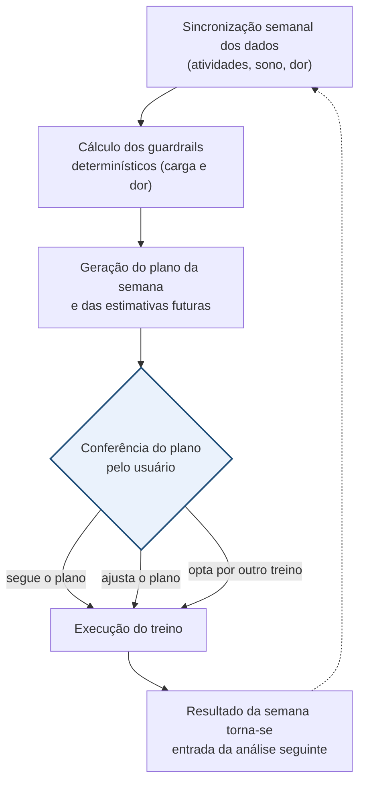

# Entendimento do Negócio: Pipeline Garmin → Recomendação de Treino com IA

Documento de Entendimento do Negócio, estruturado segundo a metodologia CRISP-DM, fase *Business Understanding*.

## 0. Identificação do projeto

**Versão do documento:** v0 (2026-09-02)

- **Código ou identificador:** GARMIN-IA-01 (identificador interno do projeto)
- **Nome formal do projeto:** Pipeline Garmin → Recomendação de Treino com IA
- **Cliente / área demandante:** projeto individual, sem cliente externo
- **Sponsor:** o próprio usuário
- **Responsável pelo projeto:** o próprio usuário (autor e mantenedor único)
- **Equipe:** o próprio usuário, atuando individualmente
- **Data formal de início:** 2026-08-13
- **Data formal de fim:** em andamento, sob ciclo contínuo de ajuste

---

# A. Descrição de mini-mundo

Um corredor treina para retomar e evoluir sua rotina de corrida depois de
meses afastado por uma lesão por sobrecarga (síndrome do estresse tibial
medial, popularmente canelite). A retomada segue um plano gradual: método
de alternância entre correr e caminhar, aumento cauteloso de volume e
fortalecimento muscular complementar. A cada saída, um relógio de pulso
registra o que aconteceu naquela sessão de treino: distância, ritmo,
frequência cardíaca, tempo em cada zona de esforço. Registra também
sinais do corpo em repouso capturados fora da sessão, como sono,
frequência cardíaca de repouso e um nível de energia percebido. O
corredor também percebe, depois de uma sessão ou ao longo da semana, se
sentiu dor e em que grau; essa percepção não vem do relógio, só de quem
correu.

Toda semana o corredor decide o que treinar na semana seguinte: que tipo
de esforço, que distância, que intensidade, considerando como o corpo
respondeu nas últimas semanas e se algum sinal de dor ou de sobrecarga
apareceu. Uma sessão de treino é o que tem identidade própria, pois
carrega esforço, sinal fisiológico e, quando anotada, dor; uma semana é o
período em que o conjunto de sessões é avaliado e a próxima decisão é
tomada.

Fora do mini-mundo: a prescrição médica ou fisioterapêutica da lesão em
si; qualquer esporte ou atividade física fora da corrida; a operação do
relógio (configuração de zonas, sincronização com o aplicativo do
fabricante).

---

# B. Glossário

- **Carga aguda:** volume de treino da semana corrente.
- **Carga crônica:** média do volume das últimas quatro semanas, incluindo a corrente.
- **ACWR (Acute:Chronic Workload Ratio):** razão entre carga aguda e carga crônica, usada como sinal de risco relativo à base de treino do próprio corredor.
- **Guardrail de carga:** checagem determinística que restringe o plano da semana quando o indicador de carga sai da faixa segura.
- **Guardrail de dor:** checagem determinística independente, que restringe o plano da semana a treinos de baixa intensidade quando a dor mais recente registrada atinge um nível relevante. Cobre a progressão sessão a sessão, complementar ao guardrail de carga, que cobre o volume agregado da semana.
- **Tipo de treino:** vocabulário fechado (Rodagem/Recuperação, Longão, Ritmo, Limiar, Intervalado, Tiro, Fartlek), derivado do sistema de zonas de treino de referência utilizado no projeto e calculado por distribuição de tempo em cada zona de frequência cardíaca.
- **Zona de frequência cardíaca do relógio:** limiares de frequência cardíaca já definidos pelo relógio, usados para computar o tempo em cada zona por sessão. Serve de base para a classificação de tipo de treino, como aproximação por zona relativa.
- **Efeito de treino aeróbico / anaeróbico:** dois indicadores contínuos calculados pelo relógio a partir do consumo de oxigênio pós-exercício, calibrados pela capacidade estimada do corredor.
- **Plano da Semana:** registro histórico cumulativo, com um item por dia de cada semana.
- **Resumo Semanal:** painel de acompanhamento, atualizado a cada execução, sem acúmulo histórico.
- **Estimativas futuras:** tipos de treino ainda sem histórico suficiente no período analisado, apresentados com um critério explícito de quando podem ser tentados. Não integram o plano da semana corrente, por não possuírem um dia específico associado.

---

# 1. Determinar os objetivos de negócio

## 1.1 Problema ou oportunidade

O relógio de corrida utilizado captura, a cada sessão, dado objetivo
suficiente para embasar a decisão de treino da semana seguinte:
distância, ritmo, frequência cardíaca, tempo em zona de esforço, sono e
frequência cardíaca de repouso. Esse dado permanece armazenado sem se
converter em recomendação: a decisão semanal de treino é tomada a partir
da percepção do próprio usuário sobre as últimas semanas, sem revisão
sistemática do histórico acumulado e sem uma checagem deliberada contra o
padrão de carga que já resultou em lesão por sobrecarga anteriormente.

O objetivo central do projeto é a evolução do treino; a ausência de
sobrecarga é uma restrição sobre esse objetivo, não um objetivo paralelo.
O projeto usa o histórico coletado para produzir progressão de treino
consistente e segura, e não apenas para prevenir lesão.

## 1.2 Decisão que o projeto deverá apoiar

A decisão apoiada pelo projeto é: qual treino realizar na semana que se
inicia, dado o histórico das últimas quatro semanas? Quem decide é o
próprio usuário, semanalmente, antes do início de cada semana de treino:
o plano gerado é seguido integralmente, ajustado ou substituído por
decisão própria. O sistema não decide nem executa o treino: produz uma
recomendação; a execução do treino permanece decisão humana em todas as
semanas.

## 1.3 Objetivo de negócio

Gerar, a cada semana, uma recomendação de treino que reflita evolução na
capacidade do corredor sem reproduzir o padrão de carga que resultou em
lesão por sobrecarga anteriormente.

## 1.4 Critérios de sucesso de negócio

- Entrega semanal automática do relatório, contendo ao menos uma recomendação concreta de treino (tipo, distância/duração, intensidade), avaliada a cada execução.
- Sinalização de risco de sobrecarga sempre que o indicador de carga sair da faixa segura, validada com dado real.
- Operação contínua do pipeline sem intervenção manual.
- Manutenção de constância de treino ao longo de sucessivas semanas sem recidiva de dor relevante, acompanhada a partir do registro de dor.
- Nenhum dado sensível de saúde versionado no repositório de código.

O controle de qualidade da recomendação não é feito por meio de um
limiar de confiança do modelo de linguagem. Dois guardrails
determinísticos, de carga semanal e de dor recente, restringem o
vocabulário de treino disponível antes da geração do plano, e cada dia do
plano é acompanhado de uma justificativa textual, conferida pelo usuário
antes da execução do treino. Esse é o mecanismo de controle de qualidade
do projeto.

## 1.5 Stakeholders

O projeto é conduzido por um único usuário, que acumula os papéis de
patrocinador, usuário final e responsável pelos dados. As regras de
treino que fundamentam o sistema foram consolidadas a partir de
literatura de ciência do esporte incorporada ao projeto: carga aguda e
crônica, distribuição polarizada de intensidade, sistema de zonas de
treino, protocolo de retomada após lesão por sobrecarga.

A rotina de análise semanal sincroniza seus próprios dados imediatamente
antes da geração do plano, garantindo que a base utilizada reflita o
período completo da semana avaliada, independentemente do horário de
outras rotinas de sincronização.

---

# 2. Avaliar a situação

## 2.1 Escopo inicial

**Dentro:** pipeline individual, um único usuário; um único esporte
(corrida); extração automática de dados do relógio; armazenamento em
banco de dados gerenciado; análise semanal via IA generativa com dois
guardrails determinísticos (carga e dor); saída em planilha eletrônica
(histórico tabular) e e-mail (plano completo, estimativas futuras e
lógica geral); orquestração automatizada, sem intervenção manual no dia a
dia.

**Fora:** qualquer esporte ou atividade física além de corrida; execução
automática do treino (agendamento no relógio ou em calendário);
diagnóstico médico ou prescrição fisioterapêutica da lesão; múltiplos
usuários; aplicativo móvel dedicado ou painel web. A interface de saída
é a planilha e o e-mail.

## 2.2 Recursos disponíveis

Todas as fontes necessárias para a operação do projeto estão disponíveis
e em uso: conta pessoal na plataforma do fabricante do relógio, planilha
eletrônica para registro complementar (dor e observações), banco de dados
gerenciado, e literatura de ciência do esporte de acesso público. A
operação é conduzida por um único usuário, sem orçamento formal,
utilizando exclusivamente camadas gratuitas dos serviços empregados.

## 2.3 Restrições

- Custo zero: nenhuma camada da arquitetura exige cartão de crédito ou gera cobrança recorrente. *(Restrição de projeto.)*
- Nenhum dado de saúde é versionado no repositório de código. *(Restrição de projeto, tratada com o mesmo rigor de uma exigência regulatória por se tratar de dado de saúde pessoal.)*
- A biblioteca de extração de dados do relógio é não-oficial, sujeita a mudanças na API do fabricante sem aviso prévio. *(Restrição técnica externa.)*
- Camadas gratuitas de provedores de IA generativa estão sujeitas a mudança de condições pelo fornecedor. *(Restrição externa.)*
- A análise cabe no ritmo semanal da rotina do usuário: uma execução por semana, antes do início do ciclo de treino. *(Restrição de uso.)*

## 2.4 Premissas

- O relógio de corrida captura dado fisiológico suficientemente confiável para orientar a decisão de treino.
- O usuário registra a dor com consistência na planilha complementar.
- As métricas coletadas (frequência cardíaca, sono, indicador de carga, zonas de esforço) cobrem o essencial do padrão de sobrecarga que resultou na lesão anterior.

## 2.5 Riscos

- **Dado (alucinação):** o modelo de linguagem pode gerar valores de ritmo ou frequência cardíaca plausíveis, porém não derivados do histórico real. Mitigação: saída estruturada por esquema de dados fixo, com faixas de referência calculadas a partir do próprio histórico do usuário, não deixadas a critério do modelo.
- **Especificação (falha de guardrail):** um erro de lógica no guardrail de carga ou de dor poderia liberar intensidade indevidamente. Mitigação: guardrails implementados como código determinístico, testado contra dado real antes de entrar em uso.
- **Segurança e privacidade:** dado de saúde (frequência cardíaca, sono, dor) trafega entre os componentes da arquitetura. Mitigação: repositório privado, nenhum dado versionado no git, credenciais mantidas fora do código-fonte.
- **Uso (aceitação sem revisão):** o usuário pode seguir o plano sem revisar a justificativa apresentada. Mitigação: nenhuma automação decide ou executa o treino de forma autônoma; a recomendação depende de decisão humana em toda semana.

O custo mais relevante entre os tipos de erro possíveis é a indicação de
progressão de intensidade quando não deveria ocorrer, por reproduzir o
padrão de carga que resultou em lesão anterior. Uma sinalização de
cautela emitida sem necessidade tem custo baixo: implica apenas
desconsiderar uma recomendação conservadora numa semana em que ela não
era estritamente necessária.

## 2.6 Custos e benefícios esperados

Os benefícios do projeto são avaliados em termos qualitativos: redução do
tempo dedicado à revisão manual do histórico de treino a cada decisão
semanal, e redução do risco de repetição do padrão de sobrecarga que
resultou em lesão anterior. Os custos operacionais são nulos, pois a
arquitetura opera integralmente em camadas gratuitas dos serviços
utilizados: banco de dados gerenciado, API do modelo de linguagem,
planilha eletrônica e orquestração automatizada.

---

# 3. Determinar os objetivos analíticos

## 3.1 Pergunta analítica

> Para cada semana de treino, antes do seu início, determinar a
> composição de treinos (tipo, distância/duração e intensidade por dia)
> que melhor equilibra evolução e ausência de sobrecarga, com base no
> histórico das quatro semanas anteriores, restringindo o vocabulário de
> treino disponível a opções de baixa intensidade sempre que um guardrail
> determinístico (carga semanal ou dor recente) indicar risco.

A restrição de vocabulário, e não a recusa de resposta, é o mecanismo
utilizado para conter risco quando os guardrails são acionados.

## 3.2 Tipo de problema

- [ ] Descritivo
- [ ] Diagnóstico
- [ ] Preditivo
- [x] Prescritivo

O sistema recomenda uma ação concreta (o treino da semana) e apresenta o
efeito esperado dessa ação. Dois componentes diagnósticos determinísticos,
o indicador de carga semanal e o registro de dor recente, fundamentam
essa recomendação, mas não constituem, isoladamente, o objetivo do
projeto.

## 3.3 Unidade de análise

Duas granularidades distintas compõem o projeto:

- **Unidade dos dados de entrada (histórico de treino):** a sessão de treino, uma atividade individual.
- **Unidade da saída (o plano gerado e registrado):** o dia dentro da semana planejada. Uma semana produz sete registros, um por dia, incluindo os dias de descanso.

Essa diferença de granularidade determinou a separação, na estrutura de
saída, entre os registros diários do plano semanal e o conteúdo de escopo
semanal (estimativas futuras e lógica geral da semana), que não possui um
dia específico associado e por isso não integra a tabela histórica
diária; esse conteúdo é entregue separadamente, por e-mail.

## 3.4 Momento da análise

O momento de referência (`t0`) é o início do período de planejamento,
antes do começo da semana de treino. A rotina de sincronização de dados é
executada nesse mesmo momento, garantindo que todas as atividades, dados
de recuperação, registros de dor e observações até esse instante estejam
disponíveis para a geração do plano, independentemente do horário de
outras rotinas de sincronização.

Está disponível em `t0`: o histórico completo das quatro semanas
anteriores. Torna-se disponível somente depois de `t0`: o resultado da
própria semana em planejamento, que passa a compor o histórico utilizado
na análise da semana seguinte.

## 3.5 Resultado ou variável-alvo

- **Nome:** plano semanal, estrutura de sete dias, cada um com tipo de treino, distância, duração, faixa de ritmo, faixa de frequência cardíaca e justificativa; acompanhada de estimativas futuras e da lógica geral da semana, fora da tabela diária.
- **Tipo:** o tipo de treino é categórico, com vocabulário fechado (Rodagem/Recuperação, Longão, Ritmo, Limiar, Intervalado, Tiro, Fartlek, Descanso).
- **Chave:** data e dia da semana, calculados de forma determinística.
- **Mecanismo de restrição:** quando um guardrail é acionado (carga semanal elevada ou dor recente relevante), o vocabulário disponível para o tipo de treino é restrito ao subconjunto de baixa intensidade.
- **Casos sem histórico suficiente:** tipos de treino ainda não realizados no período analisado não integram o plano da semana corrente; são apresentados como estimativas futuras, cada uma com um critério explícito de quando podem ser tentadas.

A validação da saída é realizada de forma qualitativa, por meio da
conferência do usuário a cada execução.

## 3.6 Entradas já antecipadas

Histórico de atividades da janela de quatro semanas (distância, duração,
ritmo, frequência cardíaca média e máxima, zonas de frequência cardíaca,
cadência, tempo de contato com solo, oscilação vertical, efeito de treino
aeróbico e anaeróbico, tipo de treino, dor); resumo semanal agregado
(volume total, indicador de carga, tendência de sono, frequência cardíaca
de repouso e nível de energia); faixas pessoais de ritmo e frequência
cardíaca por tipo de treino, calculadas a partir do próprio histórico;
observações em texto livre da mesma janela de quatro semanas.

Excluído deliberadamente: calorias, por não agregar sinal que
duração, distância e frequência cardíaca já não capturem; dado de outros
esportes, por estar fora do mini-mundo do projeto.

## 3.7 Critérios de sucesso analítico

- A referência de comparação é a decisão de treino tomada sem revisão sistemática do histórico acumulado.
- O custo mais relevante entre os tipos de erro possíveis é a indicação de progressão de intensidade quando não deveria ocorrer.
- Cada dia do plano é acompanhado de uma justificativa textual, e a semana como um todo de uma explicação geral, exigência que permite a conferência do plano pelo usuário antes da execução do treino.
- A regra de contenção de risco é a restrição de vocabulário por guardrail determinístico, aplicada antes da geração do plano.
- A avaliação de sucesso analítico é qualitativa, realizada pela conferência do usuário a cada execução.

## 3.8 Pontos em aberto

1. Estabelecer se o plano sugerido deve ser comparado, de forma estruturada, ao treino efetivamente realizado.
2. Definir o critério de encerramento da fase de ajuste fino do projeto.
3. Definir o gatilho de migração da estratégia de autenticação caso o token de sessão utilizado na extração de dados deixe de ser reutilizável.
4. Avaliar a adoção de registro sistemático do tempo de revisão manual anterior ao pipeline, para estabelecer uma linha de base quantitativa.
5. Avaliar se os guardrails e as faixas de referência atuais permanecem válidos caso o objetivo de treino mude de retomada pós-lesão para preparação de prova.
6. Avaliar a recalibração dos limiares de zona de frequência cardíaca para aproximar com mais precisão o sistema de zonas de treino utilizado como referência.
7. Avaliar a adoção de um processo de validação quantitativa, complementar à conferência qualitativa, para a saída do plano semanal.
8. Definir o comportamento esperado do pipeline em caso de alteração ou descontinuação do modelo de linguagem utilizado pelo provedor.
